*Изображение: Баннер Dota 2*

# Dota 2: Погружение в Мир Эпических Битв

## Обо Мне

Привет! Я активный игрок Dota 2 с рейтингом 7300 MMR. В основном играю на следующих героях:

### Мои Герои

#### Luna
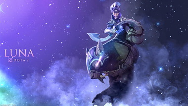
*Изображение: Luna*

**Описание:** Luna — ловкий керри с мощными ультимейтами, способными нанести значительный урон вражеским героям и крипам. Её способность "Eclipse" позволяет наносить массовый урон врагам вокруг неё, делая её отличным выбором для быстрой ликвидации противников.

#### Naga Siren
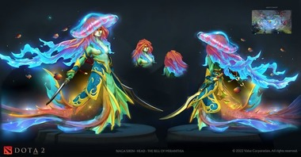
*Изображение: Naga Siren*

**Описание:** Naga Siren специализируется на контроле карты и создании иллюзий, что делает её сильной в поздней игре. Её ультимейт "Song of the Siren" может изменить ход сражения, позволяя команде инициировать атаки или отступать.

#### Shadow Fiend
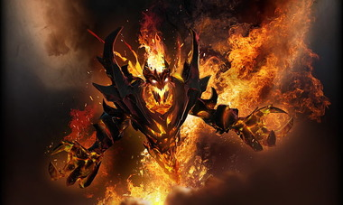
*Изображение: Shadow Fiend*

**Описание:** Shadow Fiend — один из самых сильных наносителей урона в игре. Его способности позволяют быстро фармить крипов и наносить огромный урон вражеским героям, особенно на средней линии.

#### Morphling
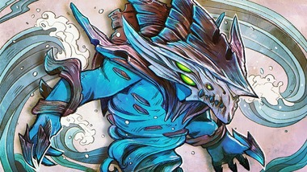
*Изображение: Morphling*

**Описание:** Morphling обладает высокой мобильностью и способностью изменять свои характеристики в зависимости от ситуации. Это делает его крайне гибким героем, способным адаптироваться к любым условиям боя.

#### Arc Warden
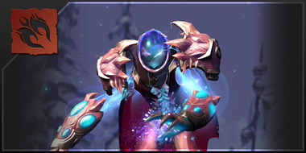
*Изображение: Arc Warden*

**Описание:** Arc Warden — уникальный герой с возможностью создавать копии себя для многозадачности. Его ультимейт "Tempest Double" позволяет одновременно выполнять несколько действий, увеличивая его эффективность на карте.

#### Terrorblade
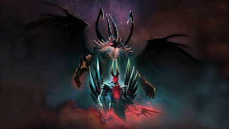
*Изображение: Terrorblade*

**Описание:** Terrorblade — мощный керри с отличными возможностями для фарма и нанесения урона. Его способности позволяют создавать иллюзии, которые могут эффективно фермить крипов и наносить урон врагам.

---

## Intro

Hunting down a flag-stealing ransomware group from WolvCTF 2023 with the power of [OSINT—from Ethereum](https://ctftime.org/team/175828) breadcrumbs to TF2 workshop maps.

- **Seiri**, or organization (think “sort” in English). Knowing where things are—using approaches such as suitable naming—is crucial. You think naming identifiers isn’t important? Read on in the following chapters.
- **Seiton**, or tidiness (think “systematize” in English). There is an old American saying: *A place for everything, and everything in its place.* A piece of code should be where you expect to find it—and, if not, you should refactor to get it there.
- **Seiso**, or cleaning (think “shine” in English): Keep the workplace free of hanging wires, grease, scraps, and waste. What do the authors here say about littering your code with comments and commented-out code lines that capture history or wishes for the future? Get rid of them.
- **Seiketsu**, or standardization: The group agrees about how to keep the workplace clean. Do you think this book says anything about having a consistent coding style and set of practices within the group? Where do those standards come from? Read on.
- **Shitsuke**, or discipline (self-discipline). This means having the discipline to follow the practices and to frequently reflect on one’s work and be willing to change.

---

## Введение

Dota 2 — одна из самых популярных и конкурентоспособных игр в жанре MOBA (Multiplayer Online Battle Arena). С момента своего релиза в 2013 году игра завоевала сердца миллионов игроков по всему миру, предлагая захватывающий геймплей, стратегические сражения и постоянные обновления.

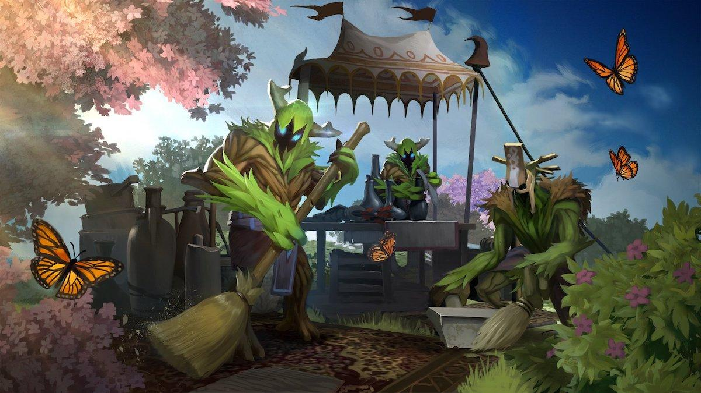
*Анимация: Инициализация игры.*

## История Dota 2

Изначально Dota (Defense of the Ancients) появилась как модификация для Warcraft III. Позже, в 2013 году, Valve Corporation выпустила самостоятельную версию игры — Dota 2. С тех пор игра постоянно развивается, привлекая новых героев, режимы и обновления.

### Этапы Развития

1. **2013:** Релиз Dota 2 и участие в The International.
2. **2015:** Введение системы косметических предметов.
3. **2017:** Запуск обновления, добавляющего новых героев и изменения баланса.
4. **2020:** Внедрение новых карт и режимов игры.
5. **2023:** Последние обновления и мероприятия The International.

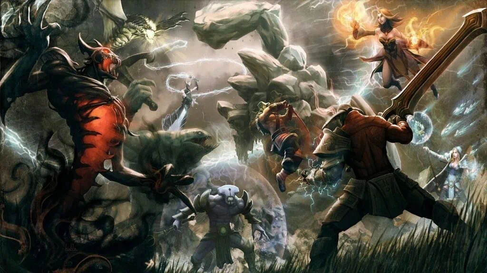
*Анимация: Таймлайн с ключевыми событиями в истории Dota 2.*

## Геймплей и Стратегия

### Основные Роли

- **Керри:** Главный наноситель урона в поздней игре.
- **Саппорт:** Поддержка керри, обеспечивает контроль и защиту.
- **Мидлайн:** Герой, играющий на средней линии, часто выполняет роль магического наносителя урона.

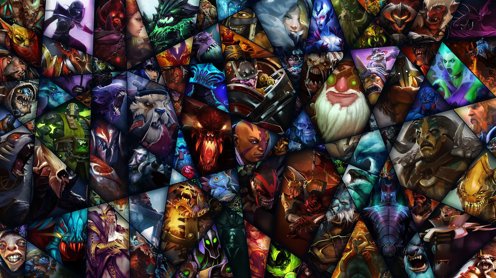
*Анимация: Демонстрация различных ролей героев в игре.*

### Карта и Линии

Карты Dota 2 разделены на три основные линии: верхнюю, среднюю и нижнюю, а также джунгли, где обитают нейтральные крипи. Правильное управление ресурсами и знание карты играют ключевую роль в победе.

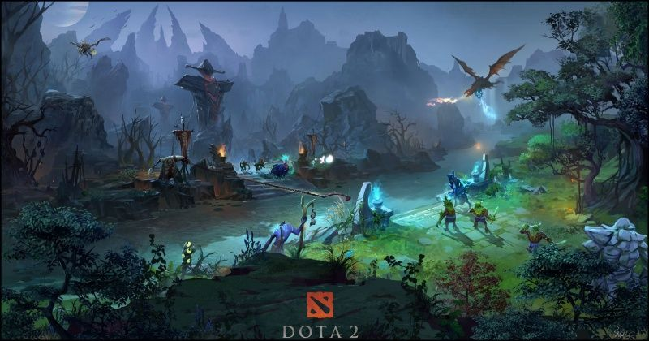
*Анимация: Обзор карты Dota 2 с выделением ключевых точек и стратегических мест.*

## Герои и Способности

В Dota 2 представлено более 100 героев, каждый из которых обладает уникальными способностями и стилем игры. Герои делятся на различные категории: сила, ловкость и интеллект, что определяет их роль и особенности в бою.

### Примеры Популярных Героев

- **Invoker:** Интеллектуальный маг с множеством комбинаций заклинаний.
- **Juggernaut:** Ловкий керри с мощным финальным ударом.
- **Axe:** Герой силы, специализирующийся на инициации и контроле противника.

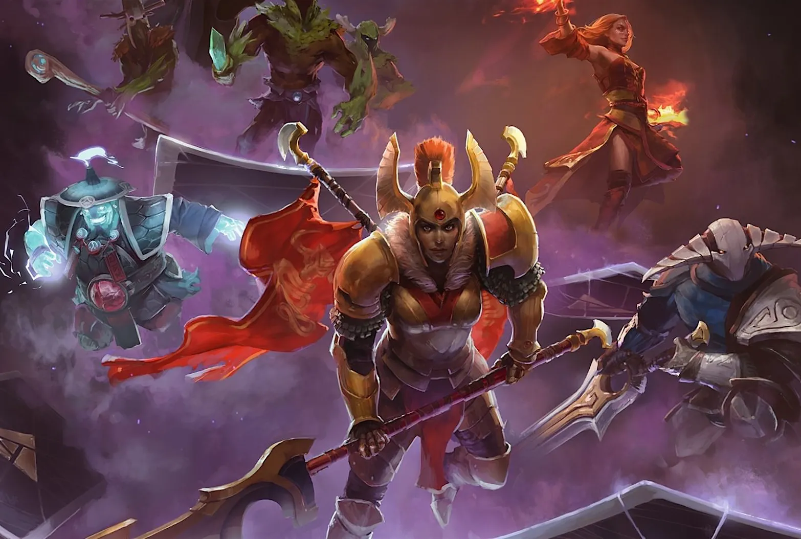
*Анимация: Короткие клипы или GIF с действиями популярных героев.*

## Соревновательный Элемент

### Турниры и Соревнования

The International — крупнейший турнир по Dota 2, ежегодно привлекающий миллионы зрителей и предлагающий рекордные призовые фонды. Помимо TI, проводятся многочисленные региональные и онлайн-турниры, позволяющие игрокам показать свои навыки на мировой арене.

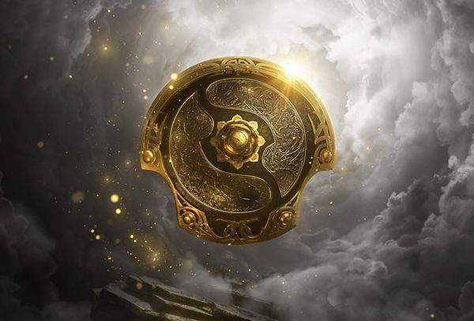
*Анимация: Кадры с предыдущих турниров The International, демонстрирующие напряженные моменты и торжественные церемонии награждения.*

### Ранг и Система Матчмейкинга

Система рангов позволяет игрокам соревноваться на уровне, соответствующем их навыкам. Ранги начинаются от "Бронза" и доходят до "Божественного", обеспечивая честные и сбалансированные матчи.

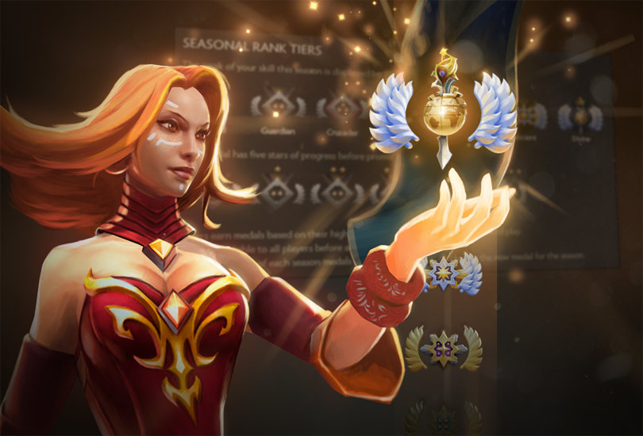
*Консольная анимация: Процесс повышения ранга или статистика игроков.*

## Сообщество и Культура

### Косплей и Арт

Сообщество Dota 2 активно участвует в создании косплеев, артов и других форм творчества, вдохновленных игрой. Это способствует укреплению связей между игроками и позволяет им выражать свою страсть к игре вне виртуального мира.

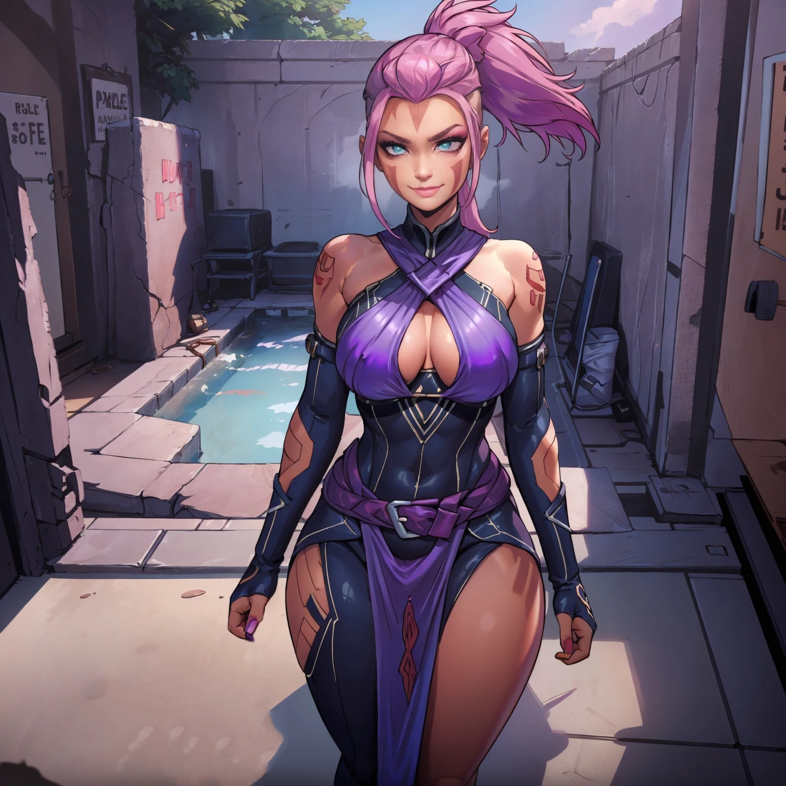
*Анимация: Галерея косплеев и фан-артов от сообщества.*

### Контент Криэйторов

Блоги, стримы и видеоролики о Dota 2 популярны среди фанатов. Контент криэйторы делятся гайдами, анализом матчей и развлекательными видео, что помогает новым игрокам освоиться в игре и поддерживает интерес существующих игроков.

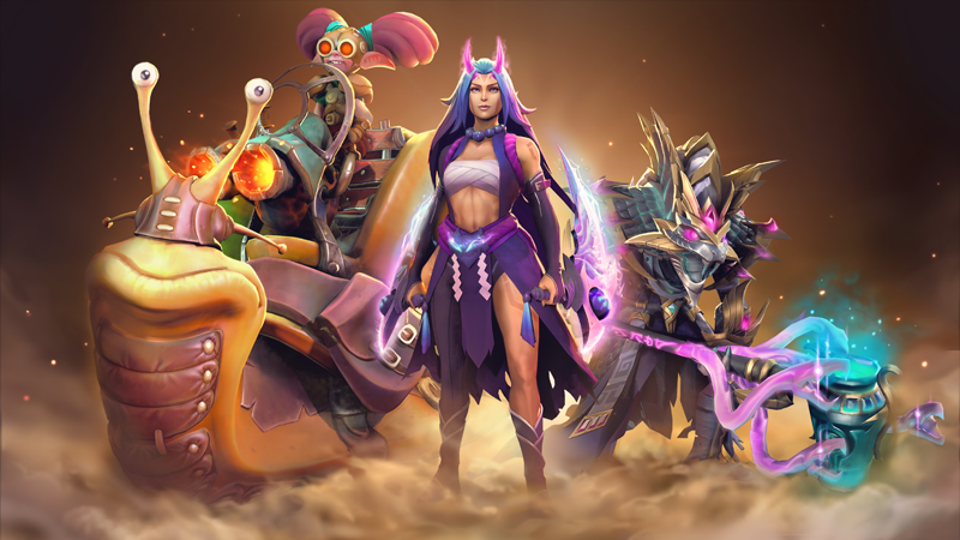
*Анимация: Видеоклипы популярных стримеров и криэйторов контента по Dota 2.*

## Заключение

Dota 2 продолжает оставаться одной из самых влиятельных и любимых игр в мире, объединяя миллионы игроков и зрителей. Её богатый геймплей, разнообразие героев и соревновательный дух делают её уникальной и захватывающей для всех, кто стремится к новым вызовам и приключениям.

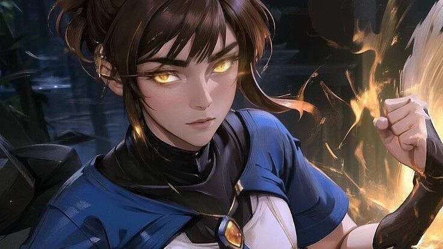
*Финальная заставка с логотипом Dota 2 и призывом присоединиться к сообществу.*
