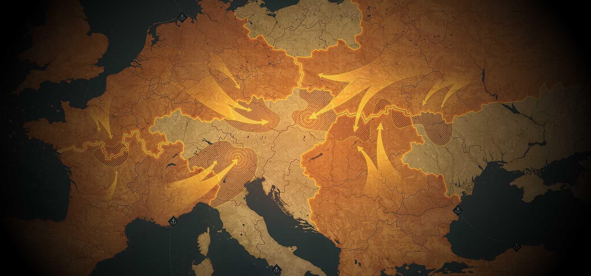

*Изображение: Баннер World of Tanks*

# World of Tanks: Погружение в Мир Танковых Битв

## Обо Мне

Привет! Я активный игрок World of Tanks с рейтингом WN8 2700. В основном играю на следующих танках:

### Мои Танки

#### об279

*Изображение: об279*

**Описание:** об279 — тяжелый танк с отличной броней и мощным орудием. Идеально подходит для прорыва вражеских линий и удержания позиций. Его высокая выживаемость позволяет эффективно противостоять атакам противника.

#### Объект-277

*Изображение: Объект-277*

**Описание:** об277 — универсальный средний танк, сочетающий в себе мобильность и огневую мощь. Отличается хорошей точностью и способностью быстро реагировать на изменения ситуации на поле боя.

#### Lion

*Изображение: Lion*

**Описание:** Лион — британский тяжелый танк, известный своей надежной броней и мощным орудием. Его способности позволяют эффективно поддерживать союзников и наносить серьезный урон врагам на средних и дальних дистанциях.

#### TVP

*Изображение: TVP*

**Описание:** Шкода ТВП — чешский легкий танк с высокой скоростью и маневренностью. Отличается хорошей точностью и способностью быстро перемещаться по карте, что делает его идеальным для разведки и фланговых атак.

---

## Intro

Hunting down a flag-stealing ransomware group from WolvCTF 2023 with the power of [OSINT—from Ethereum](https://ctftime.org/team/175828) breadcrumbs to TF2 workshop maps.

It is normal for flaws in concurrent code to hide. Simple tests often don’t expose them. Indeed, they often hide during normal processing. They might show up once every few hours, or days, or weeks!
The reason that threading bugs can be infrequent, sporadic, and hard to repeat, is that only a very few pathways out of the many thousands of possible pathways through a vulnerable section actually fail. So the probability that a failing pathway is taken can be startlingly low. This makes detection and debugging very difficult.
How might you increase your chances of catching such rare occurrences? You can instrument your code and force it to run in different orderings by adding calls to methods like `Object.wait()`, `Object.sleep()`, `Object.yield()` и `Object.priority()`.
Each of these methods can affect the order of execution, thereby increasing the odds of detecting a flaw. It’s better when broken code fails as early

---

## Введение

World of Tanks — одна из самых популярных и конкурентоспособных игр в жанре танковых симуляторов. С момента своего релиза игра завоевала сердца миллионов игроков по всему миру, предлагая захватывающий геймплей, стратегические сражения и постоянные обновления.

*Анимация: Инициализация игры.*

## История World of Tanks

Изначально World of Tanks появилась как проект студии Wargaming.net, стремясь предложить реалистичный танковый симулятор с акцентом на командные бои и стратегическое планирование. С момента своего запуска игра постоянно развивается, привлекая новых танков, карты и режимы игры.

### Этапы Развития

1. **2010:** Начало разработки World of Tanks.
2. **2011:** Официальный релиз игры.
3. **2013:** Введение системы рейтинга WN8.
4. **2015:** Добавление новых танков и карт.
5. **2020:** Запуск обновлений, улучшающих баланс и геймплей.
6. **2024:** Последние обновления и мероприятия, включая WolvCTF 2023.

*Анимация: Таймлайн с ключевыми событиями в истории World of Tanks.*

## Геймплей и Стратегия

### Основные Роли

- **Тяжелый танк (Heavy Tank):** Главный танк для прорыва вражеских линий и выдерживания урона.
- **Средний танк (Medium Tank):** Универсальный танк с балансом между мобильностью и огневой мощью.
- **Легкий танк (Light Tank):** Танки разведки с высокой скоростью и маневренностью.
- **Самоходная артиллерия (SPG):** Поддержка команды с возможностью дальнего огня и разведки.

*Анимация: Демонстрация различных ролей танков в игре.*

### Карта и Линии

Карты World of Tanks разделены на различные зоны, где важно стратегически размещать свои силы и контролировать ключевые точки. Правильное управление ресурсами и знание карты играют ключевую роль в победе.

*Анимация: Обзор карты World of Tanks с выделением ключевых точек и стратегических мест.*

## Танки и Их Способности

В World of Tanks представлено множество танков, каждый из которых обладает уникальными характеристиками и стилем игры. Танки делятся на различные категории: тяжелые, средние, легкие и самоходную артиллерию, что определяет их роль и особенности в бою.

### Примеры Популярных Танков

- **об279:** Тяжелый танк с отличной броней и мощным орудием. Идеально подходит для прорыва вражеских линий и удержания позиций.
- **об277:** Универсальный средний танк, сочетающий мобильность и огневую мощь. Отличается хорошей точностью и способностью быстро реагировать на изменения ситуации.
- **Лион:** Британский тяжелый танк, известный своей надежной броней и мощным орудием. Отлично поддерживает союзников и наносит серьезный урон врагам.
- **Шкода ТВП:** Чешский легкий танк с высокой скоростью и маневренностью. Идеален для разведки и фланговых атак.

*Анимация: Короткие клипы или GIF с действиями популярных танков.*

## Соревновательный Элемент

### Турниры и Соревнования

World of Tanks проводит множество турниров и соревнований, включая крупнейший турнир — **WolvCTF 2023**, который привлекает тысячи игроков и зрителей. Помимо крупных турниров, регулярно проводятся региональные и онлайн-соревнования, позволяющие игрокам показать свои навыки на мировой арене.

*Анимация: Кадры с предыдущих турниров WolvCTF, демонстрирующие напряженные моменты и торжественные церемонии награждения.*

### Рейтинг и Система Матчмейкинга

Система рейтинга WN8 позволяет игрокам соревноваться на уровне, соответствующем их навыкам. Рейтинг начинается от новичка и достигает элитных уровней, обеспечивая честные и сбалансированные матчи.

*Консольная анимация: Процесс повышения рейтинга или статистика игроков.*

## Сообщество и Культура

### Косплей и Арт

Сообщество World of Tanks активно участвует в создании косплеев, артов и других форм творчества, вдохновленных игрой. Это способствует укреплению связей между игроками и позволяет им выражать свою страсть к игре вне виртуального мира.

*Анимация: Галерея косплеев и фан-артов от сообщества.*

### Контент Криэйторов

Блоги, стримы и видеоролики о World of Tanks популярны среди фанатов. Контент криэйторы делятся гайдами, анализом матчей и развлекательными видео, что помогает новым игрокам освоиться в игре и поддерживает интерес существующих игроков.

*Анимация: Видеоклипы популярных стримеров и криэйторов контента по World of Tanks.*

## Заключение

World of Tanks продолжает оставаться одной из самых влиятельных и любимых игр в мире, объединяя миллионы игроков и зрителей. Её богатый геймплей, разнообразие танков и соревновательный дух делают её уникальной и захватывающей для всех, кто стремится к новым вызовам и приключениям.

*Финальная заставка с логотипом World of Tanks и призывом присоединиться к сообществу.*
