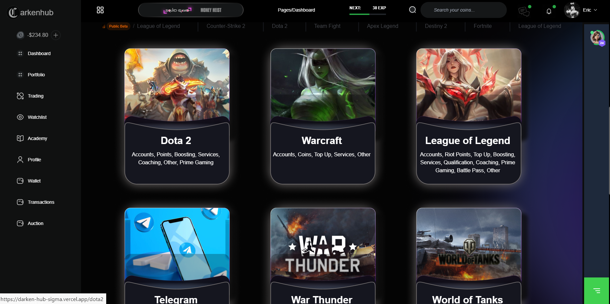
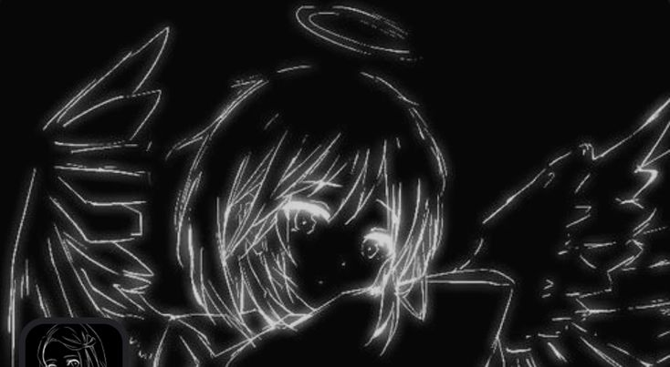
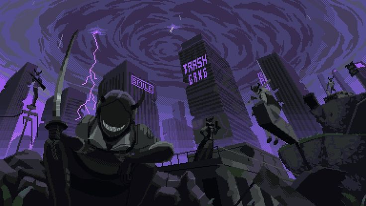
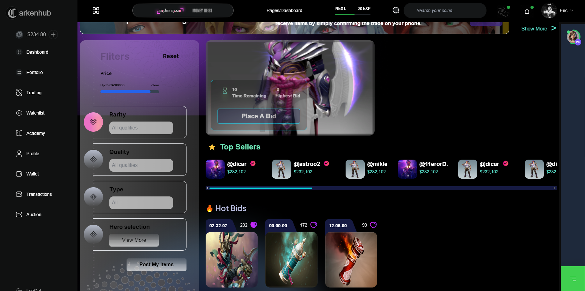

# Darken Hub: Ваш универсальный центр для игровых ценностей, турниров и трансляций

## Введение

В мире видеоигр цифровые ценности стали неотъемлемой частью игрового опыта. Игроки стремятся приобретать, продавать и обменивать внутриигровые предметы, а также участвовать в турнирах и смотреть трансляции, чтобы повысить свой уровень мастерства и наслаждаться игровым процессом. **Darken Hub** — это инновационная платформа, созданная для удовлетворения всех этих потребностей, предоставляя пользователям удобное и безопасное пространство для взаимодействия.



## О компании

**Darken Hub** — это передовой сервис, разработанный командой энтузиастов видеоигр и технологий. Наша миссия — предоставить геймерам по всему миру платформу, которая объединяет продажу игровых ценностей, организацию турниров и трансляций, создавая уникальное сообщество, где каждый может найти что-то для себя.

### Наша миссия

Мы стремимся сделать игровой опыт максимально комфортным и увлекательным, обеспечивая безопасные транзакции, захватывающие турниры и качественные трансляции. **Darken Hub** — это место, где игроки могут развиваться, соревноваться и общаться.

### Наша команда

Наша команда состоит из профессионалов в области разработки, маркетинга и поддержки пользователей. Мы постоянно работаем над улучшением платформы, учитывая отзывы и пожелания наших пользователей.



## Основные функции Darken Hub

### 1. Продажа игровых ценностей

#### Безопасные и удобные транзакции

На **Darken Hub** вы можете легко покупать и продавать внутриигровые предметы. Платформа обеспечивает безопасные транзакции, защищая ваши данные и предотвращая мошенничество.

- **Разнообразие товаров**: От редких скинов и оружия до эксклюзивных персонажей и аксессуаров.
- **Удобные методы оплаты**: Поддержка различных способов оплаты, включая кредитные карты, электронные кошельки и криптовалюты.
- **Гарантия безопасности**: Наши системы безопасности обеспечивают защиту ваших транзакций и личных данных.

> ⚠️ **Внимание**: Всегда проверяйте репутацию продавца перед покупкой. Используйте только проверенные методы оплаты для защиты своих средств.

#### Легкость использования

Интуитивно понятный интерфейс позволяет пользователям быстро находить нужные товары и оформлять покупки без лишних сложностей.

- **Поиск и фильтрация**: Мощные инструменты поиска и фильтрации помогают найти нужные предметы по различным параметрам.
- **Простая навигация**: Удобная навигация по категориям и разделам делает процесс покупки максимально комфортным.
- **Отзывы и рейтинги**: Система отзывов и рейтингов помогает определить надежных продавцов и качественные товары.



### 2. Турниры

#### Организация и участие в турнирах

**Darken Hub** предоставляет платформу для организации и участия в различных игровых турнирах. Независимо от вашего уровня мастерства, вы найдете подходящие соревнования.

- **Различные игры**: Поддержка множества популярных игр, от шутеров до стратегий и MOBA.
- **Разнообразие форматов**: Индивидуальные и командные турниры, а также лиги и чемпионаты.
- **Призы и награды**: Щедрые призовые фонды и эксклюзивные награды для победителей.

> 🔥 **Совет**: Регулярно проверяйте раздел "Турниры" для участия в новых соревнованиях и увеличения шансов на победу.

#### Поддержка сообщества

Мы стремимся создать активное и сплоченное сообщество игроков, где каждый может найти единомышленников и соревноваться на равных условиях.

- **Чаты и форумы**: Возможность общаться с другими участниками турниров, делиться стратегиями и опытом.
- **Трансляции матчей**: Прямые трансляции турниров для зрителей с комментариями и аналитикой.
- **События и акции**: Регулярные события и специальные акции для участников и зрителей.


### 3. Трансляции

#### Высококачественные трансляции

На **Darken Hub** вы можете смотреть трансляции любимых игр и турниров в высоком качестве. Мы сотрудничаем с профессиональными стримерами и комментаторами, чтобы обеспечить наилучший опыт просмотра.

- **HD и 4K трансляции**: Поддержка высоких разрешений для четкого и плавного изображения.
- **Интерактивные чаты**: Возможность взаимодействовать с другими зрителями и стримерами в реальном времени.
- **Записи трансляций**: Доступ к архиву трансляций для просмотра в удобное время.

> 💡 **Полезно знать**: Вы можете подписаться на любимых стримеров, чтобы не пропустить их новые трансляции и события.

#### Возможности для стримеров

Если вы хотите делиться своим игровым процессом с аудиторией, **Darken Hub** предоставляет все необходимые инструменты для создания и управления трансляциями.

- **Простая настройка**: Интуитивно понятные инструменты для настройки и начала трансляции.
- **Монетизация**: Варианты монетизации вашего контента через донаты, подписки и рекламу.
- **Аналитика и статистика**: Подробные отчеты о просмотрах, вовлеченности и доходах.


## Преимущества использования Darken Hub

### Удобство и доступность

**Darken Hub** разработан с учетом потребностей современных геймеров, предоставляя удобный доступ ко всем необходимым функциям в одном месте.

- **Кроссплатформенность**: Доступ к сервису с различных устройств — ПК, смартфонов, планшетов.
- **Мобильное приложение**: Специальное приложение для удобного использования на ходу.
- **Многоязычная поддержка**: Интерфейс доступен на нескольких языках для удобства пользователей со всего мира.


### Безопасность и надежность

Мы придаем большое значение безопасности и надежности нашего сервиса, обеспечивая защиту данных и транзакций пользователей.

- **Шифрование данных**: Все данные пользователей защищены современными методами шифрования.
- **Служба поддержки**: Круглосуточная поддержка для решения любых вопросов и проблем.
- **Регулярные обновления**: Постоянное совершенствование платформы и добавление новых функций.

> 🔒 **Важно**: Никогда не делитесь своими учетными данными с третьими лицами. Мы никогда не запрашиваем пароли по электронной почте или в чатах.

### Сообщество и поддержка

**Darken Hub** стремится создать активное и поддерживающее сообщество, где каждый пользователь может найти поддержку и взаимодействие.

- **Форумы и блоги**: Платформа для обсуждения новостей, стратегий и опыта.
- **События и встречи**: Организация онлайн и офлайн мероприятий для укрепления сообщества.
- **Партнерства и сотрудничество**: Сотрудничество с разработчиками игр, стримерами и другими партнерами для расширения возможностей платформы.


## Как начать работу с Darken Hub

### Регистрация и создание аккаунта

Для начала использования **Darken Hub** необходимо зарегистрироваться и создать личный аккаунт.

1. **Перейдите на сайт**: [Darken Hub](https://darken-hub-sigma.vercel.app/user/dashboard)
2. **Нажмите "Регистрация"**: Заполните необходимые поля — имя пользователя, электронную почту и пароль.
3. **Подтвердите email**: Перейдите по ссылке в письме для подтверждения регистрации.
4. **Настройте профиль**: Добавьте аватар, заполните информацию о себе и настройте предпочтения.


> 🚀 **Совет**: Используйте сложный пароль и включите двухфакторную аутентификацию для дополнительной безопасности вашего аккаунта.

### Добавление и продажа игровых ценностей

После регистрации вы можете начать добавлять свои игровые ценности для продажи.

1. **Перейдите в раздел "Продажа"**: Выберите категорию и игру, для которой хотите продать предметы.
2. **Добавьте товар**: Заполните информацию о предмете — название, описание, цену и фотографии.
3. **Опубликуйте объявление**: После проверки информации ваше объявление станет доступным для других пользователей.
4. **Управление продажами**: Следите за статусом ваших объявлений и управляйте ими через личный кабинет.


### Участие в турнирах

**Darken Hub** предлагает разнообразные турниры для игроков всех уровней.

1. **Выберите турнир**: Перейдите в раздел "Турниры" и выберите интересующее вас соревнования.
2. **Зарегистрируйтесь**: Заполните форму регистрации и подтвердите участие.
3. **Подготовьтесь к соревнованиям**: Используйте доступные ресурсы для подготовки и повышения своего уровня.
4. **Участвуйте и побеждайте**: Примите участие в турнире, сразитесь с другими игроками и выиграйте призы.


> 🏆 **Рекомендация**: Участвуйте в небольших турнирах для начала, чтобы набраться опыта перед участием в крупных соревнованиях.

### Просмотр и создание трансляций

**Darken Hub** позволяет как смотреть, так и создавать трансляции игр.

1. **Просмотр трансляций**: Перейдите в раздел "Трансляции" и выберите интересующие вас стримы.
2. **Подпишитесь на стримера**: Получайте уведомления о новых трансляциях любимых стримеров.
3. **Создание трансляции**:
- **Настройте оборудование**: Убедитесь, что ваше оборудование готово для трансляции.
- **Запустите трансляцию**: Используйте встроенные инструменты для начала трансляции.
- **Взаимодействуйте с аудиторией**: Общайтесь с зрителями через чат и получайте обратную связь.


## Дополнительные функции Darken Hub

### Персонализация профиля

Мы понимаем, насколько важно иметь уникальный профиль на платформе. **Darken Hub** предоставляет широкий спектр возможностей для персонализации вашего аккаунта.

- **Аватары и баннеры**: Выбирайте из множества аватаров или загрузите собственные изображения.
- **Статусы и достижения**: Отображайте свои достижения и статусы, чтобы другие пользователи могли узнать о ваших успехах.
- **Настройки приватности**: Контролируйте, какую информацию вы хотите делиться с другими пользователями.


### Интеграция с социальными сетями

**Darken Hub** позволяет интегрировать ваш аккаунт с различными социальными сетями, что упрощает процесс входа и обмена контентом.

- **Авторизация через соцсети**: Входите в систему с помощью аккаунтов в Twitter, Facebook, Google и других.
- **Обмен достижениями**: Делитесь своими достижениями и победами в социальных сетях напрямую с платформы.
- **Синхронизация контактов**: Найдите и добавьте друзей, которые уже пользуются **Darken Hub**.


### Инструменты аналитики

Мы предоставляем инструменты аналитики, которые помогут вам лучше понимать свою аудиторию и улучшать свои стратегии.

- **Аналитика продаж**: Отслеживайте свои продажи, анализируйте популярные товары и оптимизируйте свои предложения.
- **Аналитика турниров**: Получайте подробные отчеты о своих выступлениях, изучайте статистику и улучшайте свои игровые навыки.
- **Аналитика трансляций**: Отслеживайте просмотры, вовлеченность аудитории и доходы от трансляций.

> 📊 **Совет**: Регулярно анализируйте свои данные, чтобы принимать информированные решения и улучшать свои результаты на платформе.

### Поддержка нескольких валют

Для удобства пользователей из разных стран **Darken Hub** поддерживает множество валют, что облегчает процесс покупок и продаж.

- **Автоматический конвертер валют**: Узнавайте актуальные курсы и конвертируйте валюту прямо на платформе.
- **Поддержка криптовалют**: Оплачивайте и получайте платежи в популярных криптовалютах для большей гибкости.


## Примеры использования Darken Hub

### Пример 1: Покупка редкого скина

**Алекс** — заядлый игрок в **Valorant**, ищет редкий скин для своего любимого агента. На **Darken Hub** он находит нужный товар, проверяет рейтинг продавца и безопасно совершает покупку с помощью криптовалюты.


### Пример 2: Участие в командном турнире

**Мария и её команда** решают принять участие в командном турнире по **League of Legends**. Они регистрируются на **Darken Hub**, следуют инструкциям по подготовке и успешно выходят в финал, выиграв ценные призы.


### Пример 3: Создание трансляции

**Иван** — начинающий стример, решает начать трансляции своих игр на **Darken Hub**. Он настраивает оборудование, запускает свою первую трансляцию и быстро набирает аудиторию благодаря качественному контенту и интерактивному общению с зрителями.


## Часто задаваемые вопросы (FAQ)

### Как безопасно продавать игровые ценности?

- **Используйте проверенных продавцов**: Проверяйте рейтинги и отзывы перед покупкой или продажей.
- **Выбирайте безопасные методы оплаты**: Используйте платформенные платежные системы или криптовалюты для защиты своих транзакций.
- **Не раскрывайте личную информацию**: Никогда не делитесь своими паролями или личными данными с другими пользователями.

### Какие игры поддерживаются на Darken Hub?

Мы поддерживаем широкий спектр популярных игр, включая **Valorant**, **League of Legends**, **Dota 2**, **Counter-Strike: Global Offensive** и многие другие. Список поддерживаемых игр постоянно расширяется.

### Как создать успешную трансляцию?

- **Качественное оборудование**: Убедитесь, что ваше оборудование для трансляции соответствует высоким стандартам.
- **Интерактивность**: Взаимодействуйте с аудиторией через чат, отвечайте на вопросы и принимайте участие в обсуждениях.
- **Регулярность**: Проводите трансляции регулярно, чтобы удерживать и увеличивать свою аудиторию.


## Политика конфиденциальности

Мы ценим вашу конфиденциальность и стремимся обеспечить максимальную защиту ваших данных.

- **Сбор данных**: Мы собираем только те данные, которые необходимы для предоставления наших услуг.
- **Использование данных**: Ваши данные используются исключительно для улучшения работы платформы и предоставления персонализированных услуг.
- **Безопасность данных**: Все данные защищены современными методами шифрования и хранения.

> 🔐 **Важно**: Мы никогда не передаём ваши данные третьим лицам без вашего согласия, за исключением случаев, предусмотренных законодательством.

## Условия использования

Используя **Darken Hub**, вы соглашаетесь с нашими условиями использования. Пожалуйста, внимательно ознакомьтесь с ними перед началом работы.

- **Регистрация**: Пользователи должны предоставить достоверную информацию при регистрации и обновлять её по мере необходимости.
- **Ответственность**: Мы не несем ответственности за действия пользователей, включая транзакции и участие в турнирах.
- **Изменения**: Мы оставляем за собой право вносить изменения в условия использования в любое время. Пользователи будут уведомлены о значительных изменениях.


## Контакты

Если у вас возникли вопросы или предложения, свяжитесь с нашей службой поддержки:

- **Email**: support@darkenhub.com
- **Телефон**: +1 (234) 567-890
- **Социальные сети**:
- [Twitter](https://twitter.com/DarkenHub)
- [Facebook](https://facebook.com/DarkenHub)
- [Discord](https://discord.gg/DarkenHub)


## Новости и обновления

### Новая функция: Автоматическое ценообразование

Мы рады представить новую функцию — **автоматическое ценообразование**, которая помогает пользователям устанавливать оптимальные цены на свои игровые ценности.

- **Анализ рынка**: Система анализирует текущие рыночные тенденции и предлагает конкурентоспособные цены.
- **Настройка параметров**: Пользователи могут настроить минимальную и максимальную цены для автоматического обновления.
- **Уведомления**: Получайте уведомления о изменениях цен и обновлениях рынка.


### Мобильное приложение

Мы запустили **мобильное приложение** для iOS и Android, позволяющее пользователям удобно управлять своими аккаунтами, просматривать товары и участвовать в турнирах прямо с мобильных устройств.

- **Удобный интерфейс**: Оптимизированный интерфейс для мобильных устройств.
- **Уведомления в реальном времени**: Будьте в курсе всех событий и обновлений.
- **Синхронизация данных**: Ваши данные синхронизируются между всеми устройствами.


### Новые партнёрства

Мы рады объявить о новых партнёрствах с ведущими разработчиками игр и стримерами. Эти партнёрства позволят нам предоставлять ещё больше эксклюзивных предложений и улучшать функциональность платформы.

- **Совместные акции**: Эксклюзивные скидки и предложения для пользователей Darken Hub.
- **Эксклюзивные предметы**: Редкие и уникальные игровые предметы, доступные только на нашей платформе.
- **Расширенные турниры**: Увеличение числа турниров и призовых фондов благодаря поддержке партнёров.


## Истории успеха

### История успеха 1: Алексей и его коллекция

**Алексей**, коллекционер игровых предметов, использует **Darken Hub** для продажи своих редких скинов. Благодаря нашей платформе он смог найти надежных покупателей и значительно увеличить свою коллекцию.

> ⭐ **Отзывы Алексея**: "Darken Hub помог мне легко и безопасно продавать мои редкие скины. Поддержка пользователей всегда готова помочь, а интерфейс платформы интуитивно понятен."


### История успеха 2: Мария и её стриминг-канал

**Мария** — популярный стример, которая использует **Darken Hub** для монетизации своих трансляций. С помощью наших инструментов она смогла увеличить доход и расширить свою аудиторию.

> 🌟 **Отзывы Марии**: "С Darken Hub моя трансляция стала более профессиональной. Возможности монетизации и аналитика помогают мне лучше понимать мою аудиторию и улучшать контент."


### История успеха 3: Команда Никиты

**Команда Никиты** участвует в турнирах на **Darken Hub** и регулярно выигрывает призы. Платформа предоставляет им все необходимые инструменты для организации тренировок и участия в соревнованиях.

> 🏅 **Отзывы команды**: "Darken Hub — это отличная платформа для команд, которые хотят соревноваться и развиваться. Организация турниров и поддержка сообщества помогают нам достигать лучших результатов."


## Советы и рекомендации

### Как выбрать лучшие игровые предметы для продажи

1. **Исследуйте рынок**: Анализируйте текущие тенденции и определяйте, какие предметы пользуются спросом.
2. **Учитывайте редкость**: Редкие предметы обычно стоят дороже и привлекают больше покупателей.
3. **Поддерживайте качество**: Всегда предоставляйте качественные фотографии и подробные описания товаров.
4. **Оптимизируйте цены**: Используйте нашу функцию автоматического ценообразования для установления конкурентоспособных цен.


### Как подготовиться к турниру

1. **Тренируйтесь регулярно**: Постоянная практика поможет улучшить ваши навыки и подготовиться к соревнованиям.
2. **Изучайте стратегии**: Анализируйте игры других участников и внедряйте эффективные стратегии в свою игру.
3. **Соберите команду**: Игра в команде требует слаженности и хорошей коммуникации. Найдите единомышленников и тренировайтесь вместе.
4. **Отдыхайте перед соревнованиями**: Убедитесь, что вы отдохнули и готовы к интенсивным матчам.


### Улучшение качества трансляций

1. **Используйте хорошее оборудование**: Качественный микрофон и камера значительно улучшают качество трансляции.
2. **Общайтесь с аудиторией**: Взаимодействие с зрителями делает трансляцию более интересной и увлекательной.
3. **Соблюдайте регулярность**: Регулярные трансляции помогают удерживать и увеличивать аудиторию.
4. **Продвигайте свои трансляции**: Делитесь ссылками на свои трансляции в социальных сетях и форумах.


## Техническая поддержка

### Часто возникающие проблемы и их решения

#### Проблема: Не могу войти в аккаунт

**Решение**:
1. Проверьте правильность введённых данных.
2. Сбросьте пароль через опцию "Забыли пароль".
3. Если проблема сохраняется, свяжитесь с нашей службой поддержки.

#### Проблема: Ошибка при продаже предмета

**Решение**:
1. Убедитесь, что все поля заполнены корректно.
2. Проверьте подключение к интернету.
3. Попробуйте обновить страницу и повторить попытку.
4. Свяжитесь с поддержкой, если ошибка не устранена.

> ⚠️ **Внимание**: Никогда не раскрывайте свои пароли или личные данные при обращении в поддержку.

### Как связаться со службой поддержки

Мы предоставляем несколько способов связи с нашей службой поддержки:

- **Онлайн-чат**: Доступен 24/7 на нашем сайте.
- **Email**: Отправляйте свои вопросы и проблемы на support@darkenhub.com.
- **Телефон**: Звоните по номеру +1 (234) 567-890 для срочной помощи.
- **Социальные сети**: Пишите нам в Twitter, Facebook или Discord для получения оперативной поддержки.


## Интеграции и API

### Интеграция с игровыми разработчиками

**Darken Hub** предлагает возможности для интеграции с разработчиками игр, предоставляя платформу для монетизации и взаимодействия с сообществом.

- **API для разработчиков**: Инструменты для интеграции внутриигровых элементов с нашей платформой.
- **Совместные акции**: Организация совместных акций и мероприятий для продвижения игр.
- **Аналитика и отчеты**: Доступ к аналитическим данным для улучшения игровых продуктов.


### Партнерские программы

Мы ценим наших партнёров и предлагаем выгодные условия сотрудничества.

- **Реферальные программы**: Получайте бонусы за привлечение новых пользователей и партнёров.
- **Спонсорство турниров**: Спонсируйте турниры и получайте узнаваемость бренда среди геймеров.
- **Совместные проекты**: Реализуйте совместные проекты и инициативы для расширения возможностей платформы.

> 🤝 **Партнёрство**: Свяжитесь с нами для обсуждения условий сотрудничества и узнайте, как **Darken Hub** может помочь вашему бизнесу.


## Ресурсы и обучение

### База знаний

Мы создали обширную базу знаний, которая поможет вам лучше понять все функции и возможности **Darken Hub**.

- **Руководства и туториалы**: Подробные инструкции по использованию платформы.
- **Часто задаваемые вопросы (FAQ)**: Ответы на наиболее распространённые вопросы.
- **Советы и рекомендации**: Полезные советы для эффективного использования всех функций платформы.


### Вебинары и обучающие видео

Регулярно проводимые вебинары и обучающие видео помогут вам освоить новые функции и улучшить свои навыки.

- **Введение в Darken Hub**: Основные функции и возможности платформы.
- **Стратегии для турниров**: Советы от профессиональных игроков и тренеров.
- **Создание качественных трансляций**: Руководства по настройке оборудования и улучшению качества трансляций.


## Инновации и будущее

### Планируемые обновления

Мы постоянно работаем над улучшением **Darken Hub** и планируем внедрить ряд новых функций:

- **VR и AR интеграции**: Внедрение виртуальной и дополненной реальности для более захватывающего игрового опыта.
- **Искусственный интеллект**: Использование AI для улучшения рекомендаций и персонализации контента.
- **Расширенные возможности кастомизации**: Более широкие возможности для персонализации профилей и магазинов.


### Технологические достижения

Мы внедряем передовые технологии, чтобы обеспечить нашим пользователям лучший опыт.

- **Блокчейн-технологии**: Использование блокчейна для обеспечения прозрачности и безопасности транзакций.
- **Машинное обучение**: Анализ пользовательских данных для предоставления персонализированных рекомендаций.
- **Облачные вычисления**: Высокая производительность и масштабируемость платформы благодаря облачным решениям.

> 🚀 **Технологическое преимущество**: Наши инновации делают **Darken Hub** одной из самых передовых платформ в сфере гейминга.


## Примеры интеграций

### Интеграция с Twitch

**Darken Hub** тесно интегрирован с Twitch, что позволяет стримерам легко подключать свои каналы и управлять трансляциями прямо с нашей платформы.

- **Автоматическая синхронизация**: Синхронизируйте свои трансляции на Twitch с аккаунтом Darken Hub.
- **Уведомления о новых подписчиках**: Получайте уведомления о новых подписчиках и донатах.
- **Аналитика трансляций**: Отслеживайте статистику и улучшайте качество своих трансляций.


### Интеграция с Discord

Мы предлагаем интеграцию с Discord для улучшения коммуникации внутри сообщества.

- **Создание серверов**: Автоматическое создание Discord-серверов для участников турниров и сообществ.
- **Боты и уведомления**: Настройка ботов для отправки уведомлений о событиях и обновлениях.
- **Роли и привилегии**: Управление ролями и привилегиями участников через Discord.


## Пользовательские истории

### История пользователя 1: Дмитрий и его успехи в турнирах

**Дмитрий**, молодой геймер, нашёл свою нишу в турнирах по **Fortnite** благодаря **Darken Hub**. Платформа предоставила ему все необходимые инструменты для участия и победы, а также поддержку сообщества, что помогло ему добиться значительных успехов.

> 🏅 **Отзывы Дмитрия**: "Участие в турнирах на Darken Hub стало для меня настоящим прорывом. Платформа предоставляет отличные условия и поддержку, что позволило мне развиваться как игроку."


### История пользователя 2: Светлана и её стриминг-карьера

**Светлана** начала свою стриминг-карьеру на **Darken Hub**, используя все доступные инструменты для создания качественного контента. Благодаря функциональности платформы и поддержке сообщества, её канал быстро набрал популярность.

> 🎥 **Отзывы Светланы**: "Darken Hub предоставил мне все необходимое для успешного стриминга. Инструменты для монетизации и аналитика помогли мне улучшить качество трансляций и увеличить аудиторию."


### История пользователя 3: Иван и его коллекция игровых предметов

**Иван** использует **Darken Hub** для управления и продажи своей коллекции игровых предметов. Платформа обеспечивает безопасные транзакции и широкую аудиторию, что позволяет ему эффективно монетизировать свои активы.

> 💼 **Отзывы Ивана**: "Продажа игровых предметов на Darken Hub проста и безопасна. Платформа помогает мне найти покупателей и управлять своими продажами без лишних хлопот."


## Планы на будущее

### Расширение списка поддерживаемых игр

Мы постоянно работаем над расширением списка поддерживаемых игр, чтобы охватить как можно больше геймеров по всему миру.

- **Новые релизы**: Поддержка популярных новых игр сразу после их релиза.
- **Ретро-игры**: Включение классических игр для удовлетворения спроса на ностальгические игры.
- **Инди-игры**: Поддержка инди-разработчиков и их проектов.


### Улучшение пользовательского интерфейса

Мы стремимся сделать наш интерфейс ещё более удобным и интуитивно понятным для пользователей всех уровней.

- **Адаптивный дизайн**: Оптимизация интерфейса для различных устройств и экранов.
- **Персонализация**: Возможность настройки интерфейса под свои предпочтения.
- **Улучшенная навигация**: Быстрый доступ ко всем функциям платформы через удобное меню и панели.


### Внедрение искусственного интеллекта

Мы планируем использовать технологии искусственного интеллекта для улучшения функциональности и персонализации платформы.

- **Рекомендательные системы**: Предлагать пользователям товары и турниры на основе их предпочтений и поведения.
- **Автоматизация процессов**: Использование AI для автоматизации модерации и поддержки пользователей.
- **Анализ данных**: Более глубокий анализ данных для предоставления полезных инсайтов и улучшения сервиса.


## Заключение

**Darken Hub** — это универсальная платформа, которая объединяет продажу игровых ценностей, организацию турниров и трансляций, предоставляя геймерам все необходимое для полноценного игрового опыта. Мы стремимся создать безопасное, удобное и активное сообщество, где каждый может найти что-то для себя. Присоединяйтесь к **Darken Hub** сегодня и откройте для себя новые возможности в мире видеоигр!


## Обратная связь

Мы всегда открыты для ваших предложений и отзывов. Помогите нам стать лучше, поделившись своим мнением!

- **Анкета обратной связи**: [Заполните здесь](https://darken-hub-sigma.vercel.app/feedback)
- **Форум**: [Присоединяйтесь к обсуждениям](https://darken-hub-sigma.vercel.app/forum)
- **Социальные сети**: Следите за нашими обновлениями и новостями в социальных сетях.


## Приложения

### Приложение A: Руководство пользователя

В этом разделе вы найдете подробные инструкции по использованию всех функций **Darken Hub**.

### Приложение B: Словарь терминов

Здесь объясняются ключевые термины и понятия, используемые на платформе.

### Приложение C: История развития

Краткая история развития **Darken Hub**, включая ключевые этапы и достижения.


## Лицензия и авторские права

Все материалы, представленные на **Darken Hub**, защищены авторскими правами и принадлежат их соответствующим владельцам. Несанкционированное копирование или распространение материалов строго запрещено.

> 📜 **Лицензия**: Используя материалы **Darken Hub**, вы соглашаетесь с нашими условиями использования и политикой конфиденциальности.


## Благодарности

Мы выражаем благодарность всем нашим пользователям, партнёрам и команде, которые внесли свой вклад в развитие **Darken Hub**.

- **Пользователи**: Ваше доверие и активное участие делают нашу платформу лучше.
- **Партнёры**: Спасибо за сотрудничество и поддержку.
- **Команда**: Ваша самоотверженность и профессионализм — основа успеха **Darken Hub**.


## Дополнительные ресурсы

- [Документация API](https://darken-hub-sigma.vercel.app/api/docs)
- [Блог Darken Hub](https://darken-hub-sigma.vercel.app/blog)
- [Поддержка клиентов](https://darken-hub-sigma.vercel.app/support)


## Последние новости

### Запуск новой функции "Гильдии"

Мы рады объявить о запуске новой функции **"Гильдии"**, которая позволит пользователям объединяться в сообщества, сотрудничать и участвовать в командных мероприятиях.

- **Создание гильдий**: Пользователи могут создавать свои собственные гильдии и приглашать других участников.
- **Совместные турниры**: Участвуйте в специальных турнирах, организованных для гильдий.
- **Общий чат**: Общайтесь с членами гильдии через общий чат и планируйте совместные мероприятия.


### Новая интеграция с Steam

Мы интегрировали **Darken Hub** с платформой **Steam**, что позволяет пользователям легко импортировать свои игровые данные и управлять ими прямо с нашей платформы.

- **Импорт инвентаря**: Автоматически импортируйте свои игровые предметы из Steam.
- **Синхронизация данных**: Все изменения в инвентаре Steam автоматически обновляются на **Darken Hub**.
- **Управление транзакциями**: Управляйте покупками и продажами игровых ценностей прямо через интеграцию с Steam.

> 🔗 **Совет**: Убедитесь, что ваш аккаунт Steam защищён и используйте двухфакторную аутентификацию для дополнительной безопасности.


### Новые способы оплаты

Мы добавили новые способы оплаты, чтобы сделать процесс покупки и продажи ещё более удобным.

- **Поддержка PayPal**: Используйте PayPal для быстрых и безопасных транзакций.
- **Поддержка криптовалют**: Теперь вы можете оплачивать и получать платежи в криптовалютах, таких как Bitcoin и Ethereum.
- **Местные методы оплаты**: Поддержка популярных местных методов оплаты для пользователей из разных стран.


## Обучающие материалы

### Видеоуроки

Мы подготовили серию видеоруководств, которые помогут вам освоить все функции **Darken Hub**.

- **Основы использования**: Введение в платформу и её основные функции.
- **Продажа игровых предметов**: Пошаговое руководство по продаже и покупке игровых ценностей.
- **Участие в турнирах**: Как зарегистрироваться и участвовать в турнирах на **Darken Hub**.
- **Создание трансляций**: Настройка оборудования и запуск своей первой трансляции.


### Статьи и гайды

Наш блог содержит множество статей и гайдов, которые помогут вам стать лучшим игроком и стримером.

- **Лучшие стратегии для турниров**: Советы от профессиональных игроков.
- **Оптимизация профиля**: Как настроить свой профиль для привлечения большего числа покупателей и зрителей.
- **Монетизация трансляций**: Эффективные способы заработка на стриминге.


## Программы лояльности

Мы ценим наших постоянных пользователей и предлагаем программы лояльности для награждения их за активность.

- **Бонусные баллы**: Накопление баллов за каждую транзакцию, участие в турнирах и просмотр трансляций.
- **Уровни привилегий**: Различные уровни привилегий, которые открываются по мере накопления баллов.
- **Эксклюзивные награды**: Получайте эксклюзивные игровые предметы и доступ к закрытым турнирам.


## Безопасность пользователей

### Меры против мошенничества

Мы предпринимаем все необходимые меры для предотвращения мошенничества и обеспечения безопасности наших пользователей.

- **Автоматическое обнаружение подозрительной активности**: Наши системы мониторят транзакции и действия пользователей, чтобы выявлять и предотвращать мошеннические действия.
- **Проверка продавцов**: Продавцы проходят проверку на достоверность, что обеспечивает безопасность покупателей.
- **Безопасные методы оплаты**: Использование безопасных методов оплаты снижает риски мошенничества.

> 🔐 **Совет**: Всегда проверяйте отзывы и рейтинги продавцов перед совершением покупки. Никогда не передавайте свои личные данные третьим лицам.

### Политика возвратов

Мы понимаем, что иногда могут возникать ситуации, требующие возврата средств или обмена товаров.

- **Условия возврата**: Подробно описаны условия, при которых возможен возврат средств или обмен товаров.
- **Процесс возврата**: Простая и понятная процедура подачи запроса на возврат.
- **Сроки обработки**: Быстрая обработка запросов на возврат для вашего удобства.


## Технические требования

### Совместимость устройств

**Darken Hub** разработан для работы на различных устройствах и операционных системах.

- **ПК и ноутбуки**: Поддержка всех современных браузеров, включая Chrome, Firefox, Safari и Edge.
- **Смартфоны и планшеты**: Оптимизировано для мобильных устройств с поддержкой iOS и Android.
- **VR-устройства**: Совместимость с виртуальными реальностями для более погружённого игрового опыта.


### Минимальные системные требования

Для оптимальной работы **Darken Hub** рекомендуем следующее:

- **Операционная система**: Windows 10 или выше, macOS 10.15 или выше, iOS 12 или выше, Android 8 или выше.
- **Браузер**: Последние версии Chrome, Firefox, Safari или Edge.
- **Интернет-соединение**: Стабильное соединение с интернетом для бесперебойной работы платформы.
- **Оборудование**: Рекомендуется использование современного оборудования для обеспечения наилучшего опыта использования всех функций платформы.


## Планы по расширению

### Географическое расширение

Мы планируем расширить нашу деятельность на новые рынки, чтобы предоставить наши услуги ещё большему числу геймеров по всему миру.

- **Локализация интерфейса**: Добавление новых языков для удобства пользователей из различных регионов.
- **Локальные серверы**: Установка серверов в новых регионах для улучшения скорости и качества обслуживания.
- **Партнёрства с местными компаниями**: Сотрудничество с местными компаниями для адаптации платформы к особенностям каждого региона.


### Новые категории товаров

Мы расширяем список категорий товаров, чтобы удовлетворить потребности самых разных геймеров.

- **Коллекционные предметы**: Включение коллекционных предметов, таких как фигурки, плакаты и мерч.
- **Цифровые услуги**: Предоставление цифровых услуг, включая консультации, обучение и настройку игр.
- **Виртуальная реальность**: Включение товаров и услуг, связанных с виртуальной реальностью.


## Социальная ответственность

### Поддержка инклюзивности

Мы стремимся создать инклюзивное сообщество, где каждый игрок чувствует себя комфортно и может свободно выражать свои идеи и мнения.

- **Доступность**: Обеспечение доступности платформы для пользователей с ограниченными возможностями.
- **Поддержка разнообразия**: Поощрение разнообразия и уважение к различным культурам и традициям.
- **Программы поддержки**: Организация программ поддержки для малоимущих и талантливых геймеров.


### Экологическая устойчивость

Мы заботимся об окружающей среде и стремимся минимизировать наш экологический след.

- **Оптимизация серверов**: Использование энергоэффективных серверов и технологий для снижения потребления энергии.
- **Цифровая экология**: Поощрение цифровых инициатив и использование экологически чистых технологий.
- **Образовательные программы**: Проведение образовательных программ о важности экологической устойчивости в игровой индустрии.


## Дополнительные сервисы

### Персональный менеджер

Для наших премиум-пользователей мы предлагаем услуги персонального менеджера, который поможет вам максимально эффективно использовать все возможности платформы.

- **Индивидуальные консультации**: Помощь в настройке аккаунта, оптимизации продаж и участии в турнирах.
- **Приоритетная поддержка**: Быстрый доступ к службе поддержки и решениям любых вопросов.
- **Эксклюзивные предложения**: Доступ к эксклюзивным товарам и событиям только для премиум-пользователей.


### Платформа для разработчиков

Мы предоставляем специальные инструменты и ресурсы для разработчиков игр, чтобы они могли интегрировать свои проекты с **Darken Hub**.

- **SDK и API**: Полный набор инструментов для интеграции игр с нашей платформой.
- **Техническая поддержка**: Поддержка разработчиков на всех этапах интеграции.
- **Промоушен**: Помощь в продвижении игр и привлечении аудитории через наши каналы.


## Инновационные технологии

### Блокчейн и NFT

Мы внедряем технологии блокчейн и NFT для обеспечения уникальности и подлинности игровых предметов.

- **Уникальные токены**: Каждый игровой предмет имеет свой уникальный токен, подтверждающий его подлинность.
- **Прозрачные транзакции**: Все транзакции записываются в блокчейн, обеспечивая прозрачность и защищенность.
- **Торговля NFT**: Возможность покупать, продавать и обменивать NFT-предметы на нашей платформе.

> 💎 **Пример**: Редкий скин для персонажа может быть представлен в виде NFT, что гарантирует его уникальность и ценность.


### Искусственный интеллект и машинное обучение

Мы используем технологии искусственного интеллекта и машинного обучения для улучшения пользовательского опыта.

- **Персонализированные рекомендации**: AI анализирует ваши предпочтения и предлагает товары и турниры, которые могут вас заинтересовать.
- **Модерация контента**: Автоматическая модерация контента для обеспечения безопасного и дружественного сообщества.
- **Анализ поведения пользователей**: Изучение поведения пользователей для оптимизации функций платформы и улучшения взаимодействия.


## Раздел для разработчиков

### Документация API

Мы предоставляем подробную документацию по API для разработчиков, желающих интегрировать свои игры и сервисы с **Darken Hub**.

- **Начало работы**: Руководства по началу работы с API.
- **Эндпоинты и методы**: Описание доступных эндпоинтов и методов для взаимодействия с платформой.
- **Примеры кода**: Примеры использования API для различных сценариев.


### Инструменты разработки

Мы предлагаем ряд инструментов для упрощения процесса разработки и интеграции.

- **SDK**: Наборы разработчика для различных языков программирования.
- **Тестовые среды**: Платформы для тестирования интеграций перед запуском в продакшн.
- **Поддержка и форумы**: Сообщество разработчиков и специалисты поддержки для решения любых вопросов.


## Социальные инициативы

### Благотворительные турниры

Мы организуем благотворительные турниры, доходы от которых направляются на поддержку различных социальных проектов.

- **Тематические турниры**: Турниры, посвящённые определённым темам или событиям.
- **Партнёрства с благотворительными организациями**: Сотрудничество с организациями для эффективного распределения средств.
- **Привлечение аудитории**: Увеличение осведомлённости и вовлечённости сообщества в благотворительные инициативы.


### Образовательные программы

Мы поддерживаем образовательные программы, направленные на развитие навыков программирования и киберспорта среди молодёжи.

- **Курсы и тренинги**: Организация курсов по программированию, разработке игр и киберспорту.
- **Стипендии и гранты**: Предоставление финансовой поддержки талантливым студентам и молодым разработчикам.
- **Менторство**: Поддержка и наставничество для участников образовательных программ.


## Промо-акции и скидки

### Еженедельные скидки

Каждую неделю мы предлагаем специальные скидки на популярные игровые предметы и услуги.

- **Скидки на скины**: Получайте скидки до 50% на редкие и эксклюзивные скины.
- **Скидки на участие в турнирах**: Экономьте на регистрации в турнирах и увеличивайте свои шансы на победу.
- **Скидки на подписки**: Специальные предложения на премиум-подписки и услуги.


### Реферальные программы

Приглашайте друзей и получайте бонусы за каждую успешную регистрацию и транзакцию.

- **Бонусы за приглашения**: Получайте бонусные баллы за каждого приглашённого пользователя, который совершит покупку или продажу.
- **Уровни рефералов**: Различные уровни бонусов в зависимости от активности приглашённых пользователей.
- **Эксклюзивные награды**: Обменивайте накопленные баллы на эксклюзивные игровые предметы и услуги.

> 🎁 **Пример**: Пригласите 10 друзей и получите бесплатный доступ к премиум-функциям на месяц.


### Сезонные акции

Мы проводим сезонные акции, приуроченные к праздникам и особым событиям в игровом мире.

- **Новогодние распродажи**: Специальные предложения и скидки в период новогодних праздников.
- **Летние турниры**: Организация летних турниров с крупными призовыми фондами.
- **Праздничные подарки**: Эксклюзивные игровые предметы и подарки для наших пользователей.


## Взаимодействие с пользователями

### Форумы и обсуждения

Наши форумы предоставляют пространство для обсуждения различных тем, связанных с играми, турнирами и трансляциями.

- **Темы и категории**: Широкий спектр тем для обсуждения, от стратегий игр до технических вопросов.
- **Модерация**: Профессиональные модераторы обеспечивают дружественную и конструктивную атмосферу.
- **Сообщество**: Взаимодействуйте с другими пользователями, делитесь опытом и находите новых друзей.


### События и встречи

Мы организуем различные онлайн и офлайн события для укрепления сообщества и предоставления возможностей для общения и соревнований.

- **Онлайн-встречи**: Вебинары, стримы и виртуальные мероприятия для всех пользователей.
- **Офлайн-события**: Конференции, встречи и турниры в реальном времени в различных городах.
- **Специальные мероприятия**: Тематические события, посвящённые популярным играм и разработчикам.


## Совместные проекты

### Коллаборации с разработчиками игр

Мы сотрудничаем с ведущими разработчиками игр для создания эксклюзивных предложений и уникальных игровых предметов.

- **Эксклюзивные скины**: Создание уникальных скинов и предметов, доступных только на **Darken Hub**.
- **Специальные события**: Организация совместных мероприятий и турниров с участием разработчиков.
- **Промо-акции**: Совместные акции и скидки для пользователей обеих платформ.


### Проекты с благотворительными организациями

Мы активно сотрудничаем с благотворительными организациями, направляя часть наших доходов на поддержку различных социальных инициатив.

- **Фонд поддержки**: Создание фонда для финансирования проектов, направленных на помощь нуждающимся.
- **Благотворительные кампании**: Проведение кампаний по сбору средств на важные социальные проекты.
- **Волонтёрские программы**: Организация волонтёрских мероприятий и акций для наших пользователей.


## Интерактивные элементы

### Встроенные видео и презентации

Для более глубокого понимания функций **Darken Hub** мы включили в статью встроенные видео и презентации.

- **Видеообзоры**: Просматривайте видеообзоры ключевых функций платформы.
- **Презентации**: Изучайте подробные презентации о новых обновлениях и функциях.
- **Интерактивные гайды**: Следуйте за интерактивными руководствами для быстрого освоения платформы.


### Галерея изображений

Исследуйте нашу галерею изображений, чтобы увидеть **Darken Hub** в действии и узнать больше о возможностях платформы.


## Промо-коды и специальные предложения

### Используйте промо-коды для скидок

Мы регулярно предлагаем промо-коды, которые позволяют получить скидки на покупки и участие в турнирах.

- **Акции для новых пользователей**: Промо-коды для первых регистраций и покупок.
- **Сезонные промо-коды**: Специальные коды, приуроченные к праздникам и событиям.
- **Промо-коды для лояльных пользователей**: Бонусы и скидки для наших постоянных пользователей.

> 🎟️ **Пример**: Введите промо-код **WELCOME50** при первой покупке и получите скидку 50%.


### Специальные предложения

Мы предлагаем эксклюзивные предложения для наших пользователей, чтобы сделать их опыт ещё более приятным и выгодным.

- **Пакеты товаров**: Скидки при покупке нескольких игровых предметов одновременно.
- **Бонусные услуги**: Бесплатные дополнительные услуги при выполнении определённых условий.
- **Эксклюзивные доступы**: Доступ к закрытым турнирам и мероприятиям только для обладателей специальных предложений.


## Технические детали

### Архитектура платформы

**Darken Hub** построен на современных технологиях, обеспечивая высокую производительность и масштабируемость.

- **Фронтенд**: Использование React для создания динамичного и отзывчивого пользовательского интерфейса.
- **Бэкенд**: Надежный серверный стек, обеспечивающий быструю обработку запросов и транзакций.
- **Базы данных**: Надёжные базы данных для хранения информации о пользователях, товарах и турнирах.
- **Инфраструктура**: Использование облачных сервисов для обеспечения стабильной работы платформы.


### Безопасность данных

Мы применяем передовые методы защиты данных, чтобы обеспечить безопасность ваших личных и финансовых данных.

- **SSL шифрование**: Все данные передаются через защищённые соединения.
- **Регулярные аудиты**: Проводим регулярные аудиты безопасности для выявления и устранения уязвимостей.
- **Политика конфиденциальности**: Строгая политика конфиденциальности, гарантирующая защиту ваших данных.


## Интерактивные карты и локации

### Местоположения серверов

Мы располагаем серверами по всему миру, чтобы обеспечить минимальную задержку и высокую скорость соединения для пользователей из разных регионов.

- **Серверы в Европе**: Быстрый доступ для пользователей из Европы.
- **Серверы в Северной Америке**: Надёжное соединение для пользователей из США и Канады.
- **Серверы в Азии**: Высокая скорость для пользователей из Азии и Океании.


### Географическое распределение пользователей

Мы гордимся тем, что **Darken Hub** имеет пользователей из различных уголков мира, создавая глобальное сообщество геймеров.

- **Международное сообщество**: Пользователи из более чем 100 стран.
- **Локализованные сообщества**: Специальные сообщества для пользователей из определённых регионов.
- **Культурное разнообразие**: Уважение к различным культурам и традициям, что делает наше сообщество более богатым и разнообразным.


## Интерактивные таблицы и списки

### Таблица поддерживаемых игр

| Название игры                   | Жанр        | Поддерживаемые функции      |
|---------------------------------|-------------|-----------------------------|
| Valorant                        | Шутер       | Продажа предметов, турниры  |
| League of Legends               | MOBA        | Турниры, трансляции         |
| Dota 2                          | MOBA        | Продажа предметов, турниры  |
| Counter-Strike: Global Offensive| Шутер       | Продажа предметов, турниры  |
| Fortnite                        | Шутер       | Турниры, трансляции         |
| Apex Legends                    | Шутер       | Продажа предметов, турниры  |

### Список поддерживаемых валют

- **USD** (Доллар США)
- **EUR** (Евро)
- **GBP** (Фунт стерлингов)
- **JPY** (Японская иена)
- **BTC** (Биткойн)
- **ETH** (Эфириум)


## Интерактивные элементы

### Встроенные видео

Для более глубокого понимания функциональности **Darken Hub** мы включили встроенные видеообзоры и руководства.

<video controls>
  <source src="https://darken-hub-sigma.vercel.app/assets/video-overview.mp4" type="video/mp4" />
  Ваш браузер не поддерживает видео.
</video>


### Встраивание презентаций

Вы можете просматривать наши презентации прямо в статье, чтобы узнать больше о наших планах и достижениях.

<iframe src="https://darken-hub-sigma.vercel.app/assets/presentation.pdf" width="100%" height="600px">
  Ваш браузер не поддерживает встроенные документы.
</iframe>

## Визуальные элементы

### Графики и диаграммы

Мы используем графики и диаграммы для отображения статистики и аналитики платформы.


### Инфографика

Наши инфографики помогают визуализировать сложную информацию и делают её более понятной.


## Обновления платформы

### Недавние обновления

Мы постоянно обновляем **Darken Hub**, чтобы предоставить нашим пользователям лучшие возможности и функции.

- **Новый дизайн интерфейса**: Современный и интуитивно понятный дизайн для улучшения пользовательского опыта.
- **Расширенные фильтры поиска**: Более точные и гибкие фильтры для поиска нужных товаров и турниров.
- **Улучшенная система уведомлений**: Более информативные и настраиваемые уведомления о событиях и обновлениях.


### Планы на ближайшее будущее

- **Запуск новых функций**: Внедрение дополнительных функций для улучшения взаимодействия и монетизации.
- **Улучшение безопасности**: Постоянное совершенствование систем безопасности для защиты данных пользователей.
- **Расширение партнёрств**: Сотрудничество с новыми разработчиками игр и компаниями для расширения возможностей платформы.


## Вопросы и ответы

### Как восстановить доступ к аккаунту?

Если вы забыли пароль или не можете войти в свой аккаунт, выполните следующие шаги:

1. Перейдите на страницу входа.
2. Нажмите на ссылку "Забыли пароль?".
3. Введите свой email и следуйте инструкциям для сброса пароля.

> 🔑 **Совет**: Используйте уникальные пароли для разных платформ и регулярно меняйте их для повышения безопасности.

### Могу ли я продавать товары из любой игры?

Мы поддерживаем продажу товаров из множества популярных игр, но некоторые игры могут иметь ограничения. Перед продажей убедитесь, что ваша игра поддерживается и не нарушает наши правила.

### Как связаться с поддержкой, если возникла проблема?

Вы можете связаться с нашей службой поддержки через несколько каналов:

- **Онлайн-чат**: Доступен 24/7 на нашем сайте.
- **Email**: Отправьте свой запрос на support@darkenhub.com.
- **Телефон**: Позвоните по номеру +1 (234) 567-890.


## Технические детали

### Используемые технологии

- **Фронтенд**: React, Redux, Tailwind CSS
- **Бэкенд**: Node.js, Express, MongoDB
- **Инфраструктура**: AWS, Docker, Kubernetes
- **Безопасность**: JWT, OAuth 2.0, SSL


### Интеграция с платежными системами

Мы интегрированы с ведущими платежными системами для обеспечения безопасных и быстрых транзакций.

- **Stripe**: Надежная обработка платежей и поддержка различных валют.
- **PayPal**: Быстрые и безопасные платежи для пользователей по всему миру.
- **Криптовалюты**: Поддержка популярных криптовалют для дополнительной гибкости.


## Социальные сети и продвижение

### Подписывайтесь на нас

Следите за нашими новостями и обновлениями в социальных сетях.

- **Twitter**: [@DarkenHub](https://twitter.com/DarkenHub)
- **Facebook**: [facebook.com/DarkenHub](https://facebook.com/DarkenHub)
- **Discord**: [discord.gg/DarkenHub](https://discord.gg/DarkenHub)
- **Instagram**: [instagram.com/DarkenHub](https://instagram.com/DarkenHub)


### Реклама и партнерство

Мы открыты для сотрудничества с рекламодателями и партнёрами, которые хотят продвигать свои продукты и услуги среди нашей аудитории.

- **Рекламные баннеры**: Размещайте рекламные баннеры на наших страницах.
- **Спонсорство событий**: Спонсируйте турниры и мероприятия для увеличения узнаваемости бренда.
- **Партнёрские программы**: Участвуйте в наших партнёрских программах и получайте комиссионные за привлечённых пользователей.


## Интерактивные элементы

### Вопросы и ответы

**Вопрос**: Как быстро я могу получить ответ от службы поддержки?

**Ответ**: Наша служба поддержки работает круглосуточно, и вы можете ожидать ответа в течение нескольких часов.

**Вопрос**: Можно ли вернуть купленный игровой предмет?

**Ответ**: Возврат игровых предметов возможен только в определённых случаях, согласно нашей политике возвратов.

### Опросы и голосования

Мы ценим мнение наших пользователей и регулярно проводим опросы и голосования для улучшения платформы.

- **Опросы о новых функциях**: Участвуйте в опросах и помогайте нам решать, какие функции внедрять в первую очередь.
- **Голосования за турниры**: Голосуйте за игры и форматы турниров, которые вы хотите видеть на платформе.
- **Обратная связь**: Делитесь своими предложениями и идеями через наши опросы.


## Резюме

**Darken Hub** — это всё, что нужно современному геймеру для полноценного игрового опыта. Наша платформа объединяет продажу игровых ценностей, участие в турнирах и трансляции, предоставляя пользователям удобный и безопасный инструмент для взаимодействия и развития. Мы стремимся создавать инклюзивное и поддерживающее сообщество, где каждый может найти своё место и возможности для роста.


## Обратная связь

Мы всегда рады услышать ваше мнение! Делитесь своими впечатлениями, предложениями и вопросами, чтобы мы могли продолжать улучшать **Darken Hub**.

- **Форма обратной связи**: [Заполните здесь](https://darken-hub-sigma.vercel.app/feedback)
- **Сообщество на Discord**: [Присоединяйтесь к нам](https://discord.gg/DarkenHub)
- **Социальные сети**: Следите за нашими обновлениями и новостями в социальных сетях.


## Поддержка пользователей

### Часто задаваемые вопросы (FAQ)

**Вопрос**: Как начать продавать игровые ценности на Darken Hub?

**Ответ**: После регистрации и настройки профиля перейдите в раздел "Продажа", выберите игру и категорию, заполните информацию о предмете и опубликуйте объявление.

**Вопрос**: Как участвовать в турнирах?

**Ответ**: Перейдите в раздел "Турниры", выберите интересующий турнир, зарегистрируйтесь и следуйте инструкциям для участия.

**Вопрос**: Какие способы оплаты доступны?

**Ответ**: Мы поддерживаем множество способов оплаты, включая кредитные карты, электронные кошельки, PayPal и криптовалюты.

### Контактная информация

Если у вас возникли вопросы или проблемы, свяжитесь с нами через следующие каналы:

- **Email**: support@darkenhub.com
- **Телефон**: +1 (234) 567-890
- **Социальные сети**:
- [Twitter](https://twitter.com/DarkenHub)
- [Facebook](https://facebook.com/DarkenHub)
- [Discord](https://discord.gg/DarkenHub)


## Примечания

### Использование изображений

Все изображения, используемые в статье, должны быть доступны по указанным URL или храниться локально в папке `public/assets` вашего проекта. Убедитесь, что пути к изображениям корректны.

### Тематическая стилизация

Если вы хотите, чтобы статья отображалась в тёмной теме, убедитесь, что ваша система стилизации поддерживает переключение тем. Вы можете добавить классы или обёртки для поддержки тёмной темы.

```mdx
<div className="dark-theme">
  <!-- Ваш контент здесь -->
</div>
